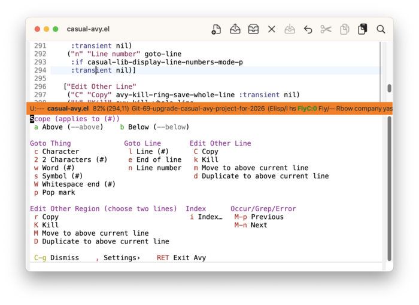

[[https://melpa.org/#/casual-avy][file:https://melpa.org/packages/casual-avy-badge.svg]] [[https://stable.melpa.org/#/casual-avy][file:https://stable.melpa.org/packages/casual-avy-badge.svg]]

* Casual Avy

Casual Avy is an opinionated [[https://github.com/magit/transient][Transient]]-based user interface for [[https://github.com/abo-abo/avy][Avy]], a GNU Emacs package for jumping to visible text using a character-based decision tree. Design motivations for Casual Avy are:

- Bring discoverability to many Avy commands.
- Bring discoverability to many commands bound with the prefix keymap ~M-g~.
  - Examples include Imenu, Occur/Grep/Error navigation, line navigation.

Casual Avy is an extension package to [[https://github.com/kickingvegas/casual][Casual]], which is included as a dependency.

* Features

Casual Avy is designed to bring discoverability to many Avy commands for an enhanced navigation and editing experience.

- Avy editing commands allow for working with a remote region or line while keeping the current point in place.
  
- Avy navigation commands allow for granular navigation to different syntactic entities (things).

* Requirements

Casual Avy requires [[https://github.com/magit/transient][Transient]] 0.9+. Versions of GNU Emacs 30.1 or greater will satisfy this requirement with its built-in version of Transient.

The following packages are also required but will be installed as dependencies if not present.

- [[https://github.com/kickingvegas/casual][Casual]] ≥ 3.0.0
- [[https://github.com/abo-abo/avy][Avy]] ≥ 0.5.0

Casual Avy has been verified with the following configuration.

- GNU Emacs 31.1 (macOS 15.7, Ubuntu Linux 22.04.5 LTS)
- Avy 0.5.0

* Install

Casual Avy is intended to be installed via ~package-install~ from MELPA, either directly or as a dependency to Casual Suite. After this installation, Casual Avy can be setup in a number of ways, as enumerated in the sub-sections below.

The design intent for using Casual Avy is to setup a global keybinding to the Transient menu ~casual-avy-tmenu~. This keybinding is specified by the customizable variable ~casual-avy-keybinding~ which is by default set to ~M-g~ and can be changed to user preference.

** Setup with Casual Suite

If you have Casual Avy installed as a dependency to [[https://github.com/kickingvegas/casual-suite][Casual Suite]], then Casual Suite will automatically setup Casual Avy. Refer to the Casual Suite [[https://github.com/kickingvegas/casual-suite#install][Install section]] for more detail.

Note that this will only work if Casual Avy is installed via ~package-install~.

** Setup with Casual only

Casual Avy includes the base Casual package as a dependency. Casual has the command ~casual-init~ which will setup all modules within it as specified in the hook variable ~casual-init-hook~. Casual Avy can be included in this hook with the following Elisp added to your Emacs initialization file:

#+begin_src elisp :lexical no
  (add-hook 'casual-init-hook #'casual-avy-init)
#+end_src

Note that this will only work if Casual Avy is installed via ~package-install~.

** Setup Casual Avy only

If only setup for Casual Avy is desired, then directly run the command ~casual-avy-init~, either manually with ~extended-execute-command~ (~M-x~) or by adding it to your Emacs initialization file.

#+begin_src elisp :lexical no
  (casual-avy-init)
#+end_src

Note that this will only work if Casual Avy is installed via ~package-install~.

** Manual Install

Casual Avy is installed outside of ~package-install~, then add the following lines to your Emacs initialization file.

#+begin_src elisp :lexical no
  (require 'casual-avy) ;; optional if using autoloaded menu
  (keymap-global-set casual-avy-keybinding #'casual-avy-tmenu)
#+end_src

* Usage

Refer to the [[https://kickingvegas.github.io/casual-avy/][Casual Avy User Guide]].

* Development

For users who wish to help contribute to Casual Avy or personally customize it for their own usage, please read the [[docs/developer.org][developer documentation]].

* Sponsorship

If you enjoy using Casual Avy, please consider buying me a coffee to help support its development and maintenance.

[[https://www.buymeacoffee.com/kickingvegas][file:docs/images/default-yellow.png]]

* Acknowledgments

A heartfelt thanks to all the contributors to [[https://github.com/abo-abo/avy][Avy]] and [[https://github.com/magit/transient][Transient]]. Casual Avy would not be possible without your efforts.
