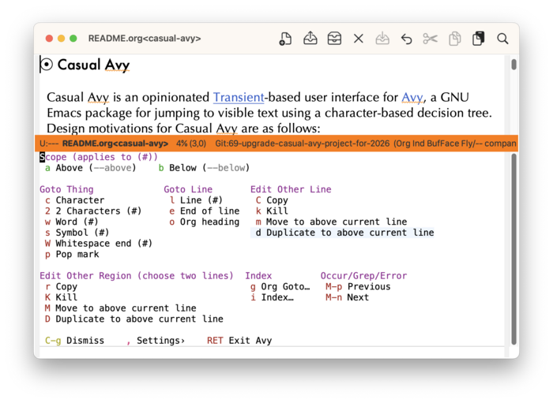

#+startup: overview nologdone
#+startup: showeverything
#+TITLE: Casual Avy User Guide
#+SUBTITLE: for version {{{version}}}
#+AUTHOR: Charles Y. Choi
#+EMAIL: kickingvegas@gmail.com
#+OPTIONS: ':t toc:t author:t email:t H:4 f:t
#+LANGUAGE: en
#+MACRO: version 3.0.1-rc.1
#+MACRO: kbd (eval (org-texinfo-kbd-macro $1))
#+TEXINFO_FILENAME: casual-avy.info
#+TEXINFO_CLASS: casual
#+TEXINFO_HEADER: @syncodeindex pg cp
#+TEXINFO_HEADER: @paragraphindent none
#+TEXINFO_TITLEPAGE: t
#+TEXINFO_DIR_CATEGORY: Emacs misc features
#+TEXINFO_DIR_NAME: Casual Avy
#+TEXINFO_DIR_DESC: A Transient user interface for Avy.
#+TEXINFO_PRINTED_TITLE: Casual Avy User Guide

Version: {{{version}}}

#+TEXINFO: Copyright © 2026 @w{Charles Y. Choi}

Casual Avy is an opinionated Transient ([[info:transient#Top]]) user interface for [[https://github.com/abo-abo/avy][Avy]], a GNU Emacs package for jumping to visible text using a character-based decision tree. Design motivations for Casual Avy are as follows:

- Bring discoverability to many Avy commands.
- Bring discoverability to many commands bound with the prefix keymap ~M-g~.
  - Examples include Imenu, Occur/Grep/Error navigation, line navigation.

[[file:images/casual-avy-screenshot.png]]

Casual Avy is an extension package to Casual ([[info:casual#Top]]), which is included as a dependency.

#+INCLUDE: "./sponsorship.org"

* Copying
:PROPERTIES:
:COPYING: t
:END:

Copyright © 2026 Charles Y. Choi

* Features
:PROPERTIES:
:CUSTOM_ID: features
:END:
#+CINDEX: Features

Casual Avy is designed to bring discoverability to many Avy commands for an enhanced navigation and editing experience.

[[file:images/casual-avy-screenshot.png]]

- Avy editing commands allow for working with a remote region or line while keeping the current point in place.
  
- Avy navigation commands allow for granular navigation to different syntactic entities (things).

* Requirements
:PROPERTIES:
:CUSTOM_ID: requirements
:END:
#+CINDEX: Requirements

Casual Avy requires usage of
- Avy ≥ 0.5.0
- Casual ≥ 3.0.0

Casual Avy has been verified with the following configuration. 
- GNU Emacs 31.1 (macOS 15.7, Ubuntu Linux 22.04.5 LTS)
- Avy 0.5.0

* Install
:PROPERTIES:
:CUSTOM_ID: install
:END:
#+CINDEX: Install
#+VINDEX: casual-avy-tmenu
#+VINDEX: casual-avy-keybinding
#+VINDEX: package-install
#+VINDEX: casual-init-hook
#+VINDEX: casual-init

Casual Avy is intended to be installed via ~package-install~ from MELPA, either directly or as a dependency to Casual Suite. After this installation, Casual Avy can be setup in a number of ways, as enumerated in the sub-sections below.

The design intent for using Casual Avy is to setup a global keybinding to the Transient menu ~casual-avy-tmenu~. This keybinding is specified by the customizable variable ~casual-avy-keybinding~ which is by default set to ~M-g~ and can be changed to user preference.

** Setup with Casual Suite

If you have Casual Avy installed as a dependency to Casual Suite [[info:casual-suite#Top]], then Casual Suite will automatically setup Casual Avy. Refer to the Casual Suite Install Section [[info:casual-suite#Install]] for more detail. 

Note that this will only work if Casual Avy is installed via ~package-install~.

** Setup with Casual only

Casual Avy includes the base Casual package as a dependency. Casual has the command ~casual-init~ which will setup all modules within it as specified in the hook variable ~casual-init-hook~. Casual Avy can be included in this hook with the following Elisp added to your Emacs initialization file:

#+begin_src elisp :lexical no
  (add-hook 'casual-init-hook #'casual-avy-init)
#+end_src

Note that this will only work if Casual Avy is installed via ~package-install~.

** Setup Casual Avy only

If only setup for Casual Avy is desired, then directly run the command ~casual-avy-init~, either manually with ~extended-execute-command~ (~M-x~) or by adding it to your Emacs initialization file.

#+begin_src elisp :lexical no
  (casual-avy-init)
#+end_src

Note that this will only work if Casual Avy is installed via ~package-install~.

** Manual Install

Casual Avy is installed outside of ~package-install~, then the 

#+begin_src elisp :lexical no
  (require 'casual-avy) ;; optional if using autoloaded menu
  (keymap-global-set casual-avy-keybinding #'casual-avy-tmenu)
#+end_src

* Usage
:PROPERTIES:
:CUSTOM_ID: usage
:END:
#+CINDEX: Usage

[[file:images/casual-avy-screenshot.png]]

Invoke the Casual Avy menu (~casual-avy-tmenu~) with the keybinding ~casual-avy-keybinding~ (default ~M-g~).

The menu is grouped into the following sections:

- Scope — Set scope for Avy command to apply to either above or below the current point.
- Goto Thing — Navigate to text /thing/.
- Goto Line — Navigate to a line.
- Edit Other Line — Line-based Avy editing commands.
- Edit Other Region — Region-based Avy editing commands.
- Index — Imenu and index-related commands.
- Occur/Grep/Error — Navigation commands for Occur, Grep, or Error.

Avy editing commands allow for editing a different line or region while /keeping the point stationary/. The following glossary details the meaning of the menu labels under the *Edit* sections.

- Copy :: Copies the selected object (line, region) into the kill ring.
- Kill :: Kills the selected object into the kill ring.
- Move to above current line :: Moves the selected object to the line above the current point.
- Duplicate to above current line :: Duplicates the selected object to the line above the current point.
  
  
** Display Line Numbers

[[file:images/casual-avy-screenshot.png]]

If ~display-line-numbers~ is non-nil, then the menu item is displayed in the /Goto Line/ section:

- (n) Line Number

** Imenu (index) Support

The Emacs Imenu (index menu) ([[info:emacs#Imenu]]) feature offers a way to navigate to a major definition in a file, provided that the current mode supports it. As Imenu behavior is closely related to Avy, support for it is provided here as the menu item labeled "(i) Index".

** Org Support

If the current buffer is an Org file, then two menu items are supported:

- (o) Org heading
- (g) Org Goto…

Selecting "Org heading" will invoke the ~avy-org-goto-heading-timer~ command. Note as with all other Avy commands, this will only work with Org headings that are visible. If navigation to any Org header is desired, select "Org Goto…" to invoke the command ~org-goto~.

* Feedback & Discussion
#+CINDEX: Feedback
Please report any feedback about *Casual Avy* to the [[https://github.com/kickingvegas/casual-avy/issues][issue tracker on GitHub]].

#+CINDEX: Discussion
To participate in general discussion about using *Casual Avy*, please join the [[https://github.com/kickingvegas/casual-avy/discussions][discussion group]].

* Sponsorship
#+CINDEX: Sponsorship

#+INCLUDE: "./sponsorship.org"

* About
#+CINDEX: About

[[https://github.com/kickingvegas/casual-avy][Casual Avy]] was conceived and crafted by Charles Choi in San Francisco, California.

Thank you for using *Casual Avy*.

Always choose love.

* Acknowledgments
#+CINDEX: Acknowledgments

A heartfelt thanks to all the contributors to [[https://github.com/abo-abo/avy][Avy]] and [[https://github.com/magit/transient][Transient]]. Casual Avy would not be possible without your efforts.

* Main Index
:PROPERTIES:
:INDEX:    cp
:END:

Index for this user guide.

* Variable Index
:PROPERTIES:
:INDEX:    vr
:END:

Variables, functions, commands, and menus referenced by this user guide.
